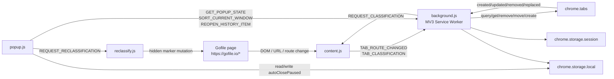
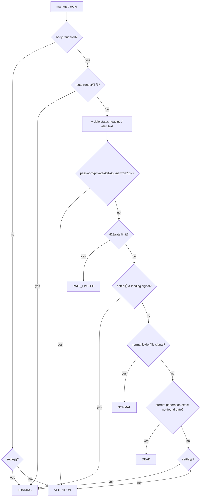
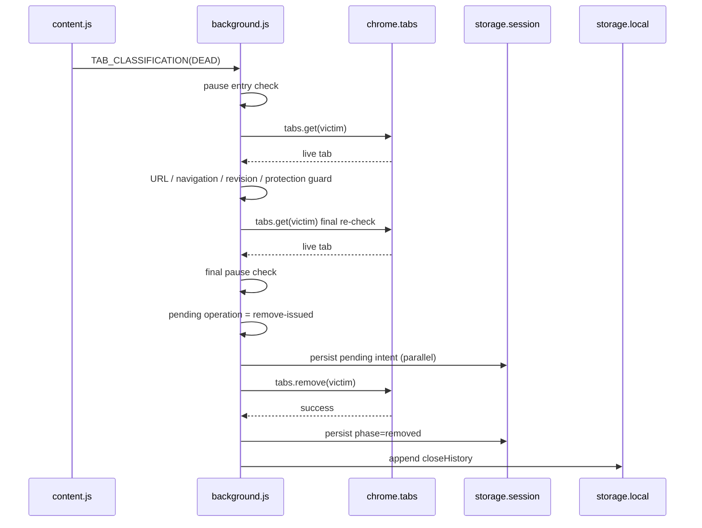
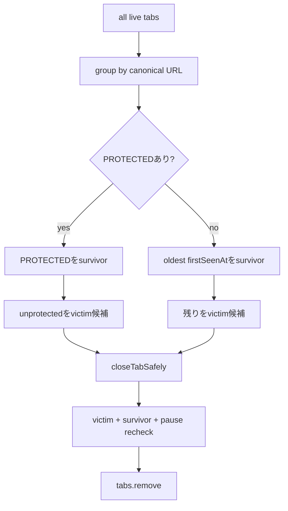
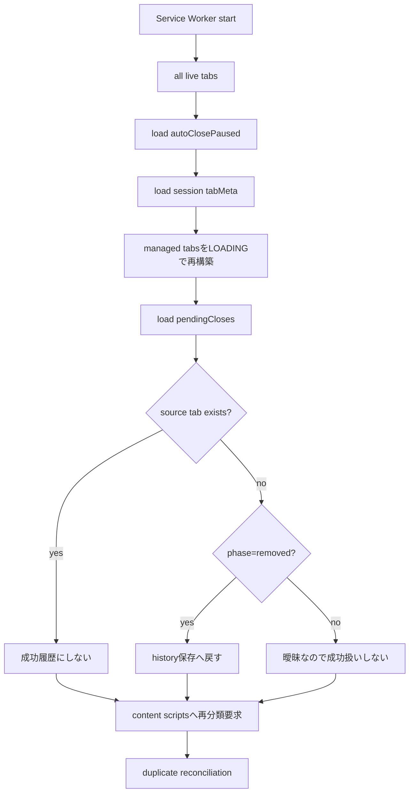

# Architecture

Gofile Tab Manager v1.1.0 のコンポーネント構成、データフロー、状態管理、安全上の設計判断をまとめます。

利用者向け情報は [../README.md](../README.md)、開発・保守上の詳細は [../DEVELOPMENT.md](../DEVELOPMENT.md)、テスト状況は [../tests/TEST_RESULTS.md](../tests/TEST_RESULTS.md) を参照してください。

## 全体構成



本拡張は Gofile API client ではありません。Gofile ページの表示状態と Chrome Extension API を境界として動作します。

## コンポーネント

### Content classification — `content.js`

`manifest.json` により `https://gofile.io/*` へ `document_start` で注入されます。

Gofile origin 全体へ注入するのは SPA 内で `/d/<contentId>` に出入りする route change を検知するためです。実際の管理対象 URL は `shared/url.js` が `/d/<contentId>` に限定します。

主な責務:

1. managed URL 判定
2. SPA route generation 管理
3. DOM classification
4. background へ route / classification 通知
5. `REQUEST_CLASSIFICATION` への応答
6. MutationObserver / route poll / settle lifecycle 管理

### Reclassification trigger — `reclassify.js`

Popup から `REQUEST_RECLASSIFICATION` を受け取ります。

分類ロジックは独自に実装せず、hidden marker を DOM へ一時的に追加・削除して `content.js` の既存 MutationObserver / debounce / route-generation guard を再利用します。

```text
Popup
  ↓ REQUEST_RECLASSIFICATION
reclassify.js
  ↓ hidden marker append/remove
content.js MutationObserver
  ↓ existing classification path
background.js
```

manual reclassification だけが別の安全条件を持たないための構成です。

### Background Service Worker — `background.js`

すべての destructive operation を担当します。

- confirmed DEAD tab close
- duplicate tab close
- auto-close pause enforcement
- current-window manual sort
- history item reopen
- storage persistence / recovery

content script / reclassify script / Popup は `tabs.remove()` を直接行いません。

### Popup — `popup.js`

現在 window の状態表示とユーザー操作の入口です。

表示:

- NORMAL
- その他 Gofile
- RATE_LIMITED
- LOADING
- ATTENTION
- PROTECTED
- Recent auto-closed

操作:

- auto-close pause / resume
- current-window reclassification
- manual sort
- history reopen

`RATE_LIMITED` / `LOADING` の detail count は live content classification を問い合わせて表示します。

## URL model

managed / canonical URL:

```text
https://gofile.io/d/<contentId>
```

canonicalization で除去:

- query
- fragment
- trailing slash

維持:

- contentId の大文字・小文字

拒否:

- HTTP
- gofile.io 以外の hostname
- 443 以外の explicit port
- `/d/<id>/extra` のような追加 path

## Classification flow



### DEAD positive signal

現行 Gofile UI では以下を組み合わせます。

```text
main#page #fm-root
main#page #fm-root h1
h1 text = This content does not exist
document.title = Content not found [· Gofile]
```

単独の `content not found` 文字列や本文中の status code は DEAD signal ではありません。

### Status text scope

password / private / 401 / 403 / 429 / 5xx 等の pattern は body 全体ではなく、可視な page heading / alert に限定します。

正常ファイル名 `429.txt`、`HTTP 503 logs.txt`、本文中の単なる `512` 等で分類が変わることを避けるためです。

### Visibility model

signal の可視性判定では対象 node 自身だけでなく ancestor chain を確認します。

- `hidden`
- `aria-hidden=true`
- dialog / modal / toast / snackbar / notification
- inline `display:none` / `visibility:hidden` / `opacity:0`
- computed `display:none`
- computed `visibility:hidden|collapse`
- computed `opacity:0`

CSS class で非表示になった stale view 配下の DEAD heading を evidence にしないための安全策です。

## SPA / BFCache lifecycle

route change を次で検出します。

- `history.pushState`
- `history.replaceState`
- `popstate`
- `hashchange`
- 250ms route poll
- `pageshow`

content script は isolated world で動くため、page-world の History API change を補足する 250ms poll を safety fallback として維持します。

`pagehide` で observer / timers / poll を停止し、`pageshow` で observer と route poll を再開します。

route ごとに `routeGeneration` と settle timer を更新します。SPA 遷移後に DOM mutation が止まっても `LOADING` が残り続けないよう generation-aware settle reclassification を行います。

### Freshness

SPA route A → B では A の DOM が B 初期表示中に残る可能性があります。

追跡 state:

- `routeGeneration`
- `routeStartedAt`
- `routeAwaitingRender`
- `freshDeadSignalGeneration`

`MutationObserver.takeRecords()` を generation advance 前に drain し、A の最後の mutation を B の evidence として誤帰属しないようにします。

## Classification message acceptance

background は content script の報告をそのまま信頼しません。

```text
message URL / canonical URL 再検証
        ↓
chrome.tabs.get(tabId)
        ↓
live URL 一致?
        ↓
navigation 中ではない?
        ↓
documentId / routeGeneration は stale でない?
        ↓
observedAt は逆行していない?
        ↓
classificationRevision を進めて採用
```

複数層の generation / identity guard により、古い async classification が現在 state を上書きして destructive close に進むことを防ぎます。

## Auto-close pause

pause preference:

```text
chrome.storage.local.autoClosePaused
```

pause 中:

- classification は継続
- DEAD close は停止
- duplicate close は停止
- Popup state は利用可能
- manual reclassification は利用可能
- manual sort は利用可能
- history reopen は利用可能

background は Service Worker 起動時に preference を読み込みます。読み込み失敗時は destructive behavior を安全側に止めるため pause 扱いにします。

`closeTabSafely()` は pause を2回確認します。

1. close entry
2. async guard 完了後、最終 `tabs.remove()` 直前

これにより guard 実行中に pause が切り替わった場合も可能な限り remove を止めます。

resume 時は background の storage listener が duplicate reconciliation を起動し、Popup は全 window の managed tabs に再判定要求を送り、停止中に残っていた DEAD を再評価します。

## DEAD close flow



user-visible remove を session storage 完了待ちにしない一方、削除前の live / identity / pause guard は維持します。

## Duplicate reconciliation



victim close 前に survivor について次を確認します。

- まだ存在する
- 同じ canonical URL
- navigation 中でない
- closing 中でない
- identity metadata が計画時と一致
- pinned / group state が計画時と一致
- unprotected survivor が DEAD ではない

## Manual sort

カテゴリ:

```text
0: 非Gofile
1: NORMAL Gofile
2: その他Gofile
```

PROTECTED は movable segment を分割する固定 barrier です。

```text
[ movable A ][ PINNED ][ movable B ][ GROUPED ][ movable C ]
```

各 segment 内だけ stable partition し、PROTECTED の構造を維持します。

各 move の前後で window を再 query し、tab set / index / pinned / group / protected structure が変われば abort します。同じ window の複数 sort は `sortChains` で直列化します。

## Persistence model

### Local storage

```text
closeHistory
autoClosePaused
```

`closeHistory`:

- durable な auto-close 履歴
- DEAD / DUPLICATE
- 最大50件

`autoClosePaused`:

- global pause preference
- Service Worker restart 後も復元

### Session storage

```text
tabMeta
pendingCloses
```

`tabMeta` は `canonicalUrl` と `firstSeenAt` だけを compact に保存します。

classification state / navigationVersion / revision / documentId は durable truth として信用せず、Worker restart 後に live tab + content script から再構築します。

`pendingCloses` は close operation recovery 用です。

## Crash recovery



`tabs.remove()` と `phase=removed` 永続化は atomic transaction ではありません。

```text
tabs.remove success
   ↓
[ worker stops here ]
   ↓
phase=removed persistence
```

この窓で停止すると extension 自身の close だったと証明できないため、履歴を復元しません。誤った成功履歴より欠落を選ぶ safety decision です。

## Messaging

message types:

```text
TAB_CLASSIFICATION
TAB_ROUTE_CHANGED
REQUEST_CLASSIFICATION
REQUEST_RECLASSIFICATION
GET_POPUP_STATE
SORT_CURRENT_WINDOW
REOPEN_HISTORY_ITEM
```

### Content → Background

`TAB_ROUTE_CHANGED`

- current URL
- canonical URL
- document generation
- observedAt

`TAB_CLASSIFICATION`

- state
- current URL
- canonical URL
- document generation
- observedAt

sender `documentId` も freshness 判定に利用します。

### Background → Content

`REQUEST_CLASSIFICATION`

- Worker start
- tab complete
- synchronization

### Popup → Content

`REQUEST_RECLASSIFICATION`

`reclassify.js` が既存 MutationObserver path を起動します。

### Popup → Background

`GET_POPUP_STATE`

- current window count
- close history

`SORT_CURRENT_WINDOW`

- current window manual sort

`REOPEN_HISTORY_ITEM`

- saved URL を再検証して新規 tab 作成

### Popup ↔ Local storage

`autoClosePaused` は Popup から read/write し、background の storage listener が変更を反映します。

## Security boundaries

要求権限:

```text
tabs
storage
https://gofile.io/*
```

現行コードでは:

- Gofile API を直接呼ばない
- Gofile credentials を保存しない
- Cookie を読むコードを持たない
- telemetry を送らない
- 外部 host permission を持たない

host permission を広げる変更は新しい security boundary の導入としてレビューしてください。

## Design decisions

### 1. False positive より false negative を許容

DEAD auto-close は destructive operation です。DOM が変わって判定できない場合は削除せず `ATTENTION` に倒します。

### 2. Live browser state is authoritative

session metadata は補助です。close 直前に live tab / URL / navigation / protection を再確認します。

### 3. Generation を複数層で持つ

- content route generation
- sender documentId
- background navigationVersion
- classificationRevision
- observedAt

異なる race を単一 timestamp に押し込めない設計です。

### 4. PROTECTED は classification と分離

page state と pinned / grouped state は別軸です。PROTECTED は browser tab property から判断します。

### 5. Sort は全体最適より安全な局所整列

PROTECTED を動かして完全な全体順を作らず、barrier 間だけ整理します。

### 6. Close History は close をブロックしない

storage latency を user-visible close の前提にしません。ただし成功の証明が曖昧な operation を history へ変換しません。

### 7. Manual reclassification は classification logic を複製しない

`reclassify.js` は trigger に限定し、通常の `content.js` safety path を再利用します。

### 8. Pause は destructive boundary で再確認

UI click 時点だけでなく `tabs.remove()` 直前にも background state を見ることで、async guard 中の pause transition を扱います。

## Testing

Automated:

- GitHub Actions
- Node.js 24
- `npm test`
- `tests/*.test.js`

Real browser:

- 2026-09-15 に v1.1.0 release candidate を検証
- 不具合なし

詳細は [../tests/TEST_RESULTS.md](../tests/TEST_RESULTS.md) を参照してください。

## License

本プロジェクトは **MIT License** で提供されます。正式なライセンス本文は [../LICENSE](../LICENSE) を参照してください。

Copyright (c) 2026 Hoyomaru
