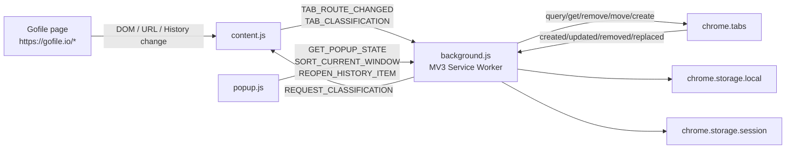
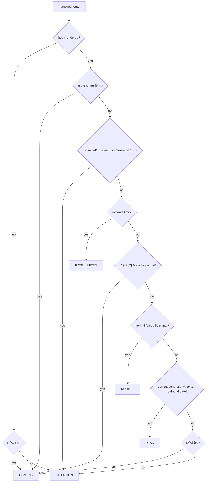
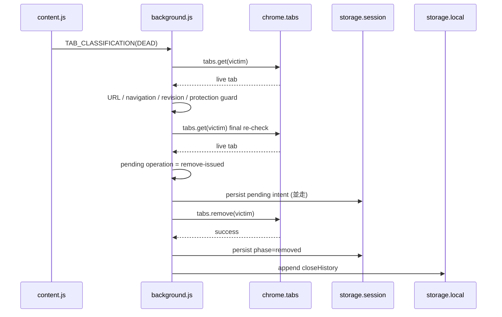
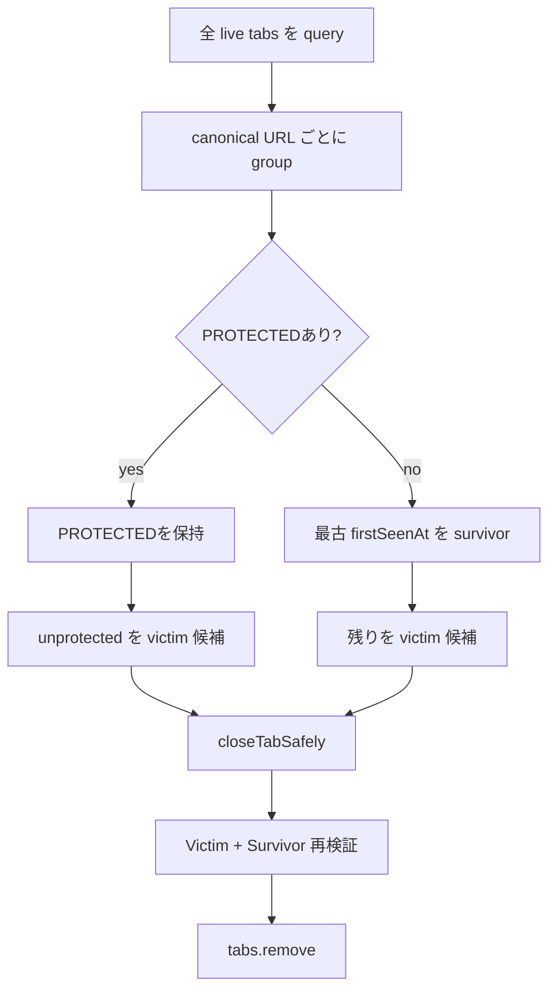
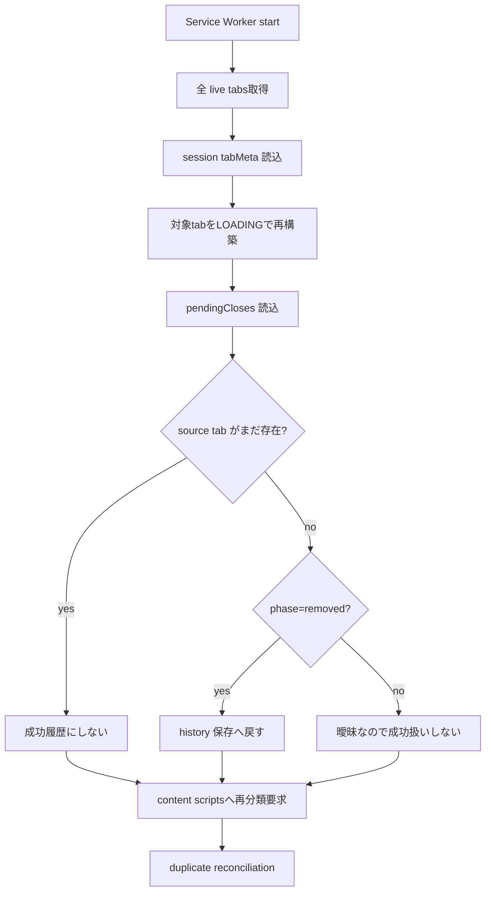

# Architecture

Gofile Tab Manager のコンポーネント構成、データフロー、状態管理、安全上の設計判断をまとめます。

利用者向け情報は [../README.md](../README.md)、開発・保守上の詳細は [../DEVELOPMENT.md](../DEVELOPMENT.md) を参照してください。

## 全体構成



本拡張は Gofile API の client ではありません。Gofile ページの表示状態と Chrome Extension API を境界として動作します。

## コンポーネント

### Content script

構成:

- `shared/constants.js`
- `shared/url.js`
- `shared/signatures.js`
- `content.js`

`manifest.json` により `https://gofile.io/*` へ `document_start` で注入されます。

Gofile origin 全体へ注入する理由は SPA 内で `/d/<contentId>` に出入りする route change を検知するためです。実際の管理対象かどうかは `shared/url.js` が厳密に判定します。

主な責務:

1. URL が管理対象か判定
2. SPA route generation を管理
3. DOM を分類
4. background へ route / classification を送る
5. background からの同期問い合わせへ応答

### Background Service Worker

`background.js` がすべての destructive operation を担当します。

- DEAD tab close
- duplicate tab close
- current-window sort
- history item reopen
- storage persistence / recovery

content script や Popup は `tabs.remove()` / `tabs.move()` を直接行いません。

### Popup

Popup は現在 window の集計表示とユーザー操作の入口です。

- NORMAL count
- その他 Gofile count
- ATTENTION count
- PROTECTED count
- 手動 sort
- Recent auto-closed
- reopen

判断ロジックは background に委譲します。

## URL モデル

管理対象 URL:

```text
https://gofile.io/d/<contentId>
```

canonical URL:

```text
https://gofile.io/d/<contentId>
```

canonicalization で除去するもの:

- query
- fragment
- trailing slash

維持するもの:

- contentId の大文字・小文字

拒否するもの:

- HTTP
- gofile.io 以外の hostname
- 443 以外の明示 port
- `/d/<id>/extra` のような追加 path

## Classification flow



### DEAD の positive signal

現行 Gofile UI に対して以下を組み合わせます。

```text
main#page #fm-root
main#page #fm-root h1
h1 text = This content does not exist
document.title = Content not found [· Gofile]
```

単独の `content not found` 文字列は DEAD signal ではありません。

### Freshness

SPA route A → B では、A の DOM が B の初期表示中に残る可能性があります。

そのため content script は:

- route generation
- route change 直後の `routeAwaitingRender`
- current generation で観測した fresh DEAD mutation

を追跡します。

`MutationObserver.takeRecords()` を route generation 更新前に drain するのは、A の最後の mutation を B の最初の mutation として扱わないためです。

## Classification message acceptance

background は content script の報告をそのまま信頼しません。

概念的な guard:

```text
message.url を再canonicalize
        ↓
message.canonicalUrl と一致?
        ↓
chrome.tabs.get(tabId)
        ↓
live URL と一致?
        ↓
navigation 中ではない?
        ↓
documentId / routeGeneration は stale でない?
        ↓
observedAt は逆行していない?
        ↓
classificationRevision を進めて採用
```

この二段階モデルにより、content script の古い async message が新しい tab 状態を上書きしにくくしています。

## DEAD close flow



重要なのは、**最終 live guard を storage write より前に済ませ、そのあと user-visible remove を storage 完了待ちにしない**ことです。

## Duplicate reconciliation



### Survivor safety

victim close 前に survivor について次を確認します。

- まだ存在する
- 同じ canonical URL
- navigation 中でない
- closing 中でない
- identity metadata が計画時と一致
- pinned / group 状態が計画時と一致
- unprotected survivor が DEAD ではない

これにより duplicate close と DEAD close が競合して最後の tab を失う危険を減らします。

## Manual sort

sort は Popup から明示的に要求された時だけ動きます。

カテゴリ:

```text
0: 非Gofile
1: NORMAL Gofile
2: その他Gofile
```

PROTECTED は movable segment を分割する barrier です。

例:

```text
[ movable A ][ PINNED ][ movable B ][ GROUPED ][ movable C ]
```

A/B/C を個別に stable partition し、PROTECTED の絶対位置構造は維持します。

### Sort concurrency safety

各 move の前後で window を再 query します。

abort 条件:

- tab set が変わった
- index snapshot が変わった
- pinned 状態が変わった
- group 状態が変わった
- protected structure が変わった
- move 対象自身が protected になった

同じ window の複数 sort は `sortChains` で直列化されます。

## Persistence model

### Local storage

```text
closeHistory
```

用途:

- ユーザー向けの durable な自動 close 履歴

上限:

- 50 件

### Session storage

```text
tabMeta
pendingCloses
```

`tabMeta` は compact に `canonicalUrl` と `firstSeenAt` だけを保存します。

分類 state を durable state として信用しない設計です。Service Worker 再起動時には分類を `LOADING` に戻し、live tab + content script から再構築します。

`pendingCloses` は close operation の復旧証拠です。

## Crash recovery



### Deliberate ambiguity handling

`tabs.remove()` と `phase=removed` 永続化は atomic transaction ではありません。

次の窓があります。

```text
tabs.remove success
   ↓
[ worker stops here ]
   ↓
phase=removed persistence
```

この窓で停止すると、再起動後は extension 自身が閉じたのか、別操作で閉じたのか証明できません。

そのため履歴を「復元しない」のが現行設計です。これはデータ欠落より誤った成功履歴を避ける判断です。

## Event model

background が監視する Tabs event:

- `chrome.tabs.onCreated`
- `chrome.tabs.onUpdated`
- `chrome.tabs.onRemoved`
- `chrome.tabs.onReplaced`

### `onUpdated`

`pendingUrl` または loading 状態を検出した時点で旧分類を無効化します。

commit 済み URL が管理対象外になれば metadata を削除します。

complete 後は content script へ再分類を要求します。

### `onReplaced`

replacement tab が同じ canonical URL なら `firstSeenAt` だけ引き継ぎます。

state は `LOADING` から再構築します。

## Messaging

定義済み message type:

```text
TAB_CLASSIFICATION
TAB_ROUTE_CHANGED
REQUEST_CLASSIFICATION
GET_POPUP_STATE
SORT_CURRENT_WINDOW
REOPEN_HISTORY_ITEM
```

### Content → Background

`TAB_ROUTE_CHANGED`

- current URL
- canonical URL
- document generation
- observedAt

`TAB_CLASSIFICATION`

- state
- current URL
- canonical URL
- document generation
- observedAt

sender の `documentId` も freshness 判定に利用します。

### Background → Content

`REQUEST_CLASSIFICATION`

Service Worker 起動時や tab complete 時の再同期に利用します。

### Popup → Background

`GET_POPUP_STATE`

- current window の count
- close history

`SORT_CURRENT_WINDOW`

- current window の manual sort

`REOPEN_HISTORY_ITEM`

- 保存 URL を再検証して新規 tab を作成

## Security boundaries

本拡張が要求する権限:

```text
tabs
storage
https://gofile.io/*
```

現行コードでは:

- Gofile API を直接呼ばない
- Gofile credentials を保存しない
- Cookie を読むコードを持たない
- telemetry を送らない
- 外部 host permission を持たない

host permission を広げる変更は、単なる実装都合ではなく新しいセキュリティ境界の導入としてレビューしてください。

## Design decisions

### 1. False positive より false negative を許容する

DEAD 自動削除は destructive operation です。

Gofile DOM が変わって判定できなくなった場合、自動削除を止めて `ATTENTION` にする方針です。

### 2. Live browser state is authoritative

session metadata は補助です。

- tab がまだ存在するか
- URL は何か
- navigation 中か
- protected か

は close 直前に `chrome.tabs.get()` で再確認します。

### 3. Generation を複数層で持つ

異なる race を区別するため、単一 timestamp だけに依存しません。

- content route generation
- sender documentId
- background navigationVersion
- classificationRevision
- observedAt

### 4. PROTECTED は状態分類と分離する

page が NORMAL / DEAD かどうかと、ブラウザ UI 上 pinned/group かどうかは別軸です。

そのため PROTECTED は content classification ではなく background の tab property から都度判定します。

### 5. Sort は全体最適より安全な局所整列

PROTECTED を動かして完全な全体順を作るのではなく、barrier 間だけを整理します。

### 6. Close History は close をブロックしない

storage latency により明確な DEAD tab が長時間残る問題を避けるため、最終 guard 後は remove を先行できます。

一方、削除成功後の history write は retry して durable に近づけます。

## 変更時に特に壊れやすい境界

- `shared/signatures.js` の DEAD selector / regex
- `content.js` の route generation と MutationObserver の順序
- `background.js` の async guard 前後
- duplicate survivor の再検証
- `pendingCloses` の phase 意味論
- `tabs.onUpdated` の pendingUrl / loading 処理
- sort の snapshot validation
- `onReplaced` の firstSeenAt 継承

これらを変更する場合、対応する regression test を先に特定し、必要なら race を再現する gate/mock を追加してください。
